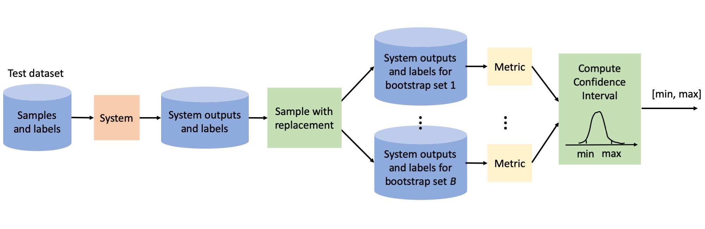

# Confidence intervals for evaluation in machine learning <!-- omit in toc -->

This repository provides a simple implementation of the bootstrapping approach to compute confidence intervals for evaluation in machine learning. In this document, we first show how to install and use the toolkit and then provide a brief tutorial into the subject.


# Table of contents <!-- omit in toc -->

- [Installation](#installation)
- [Basic usage](#basic-usage)
  - [Input data](#input-data)
- [Tutorial](#tutorial)
  - [Evaluation of systems](#evaluation-of-systems)
  - [Evaluation of methods](#evaluation-of-methods)
  - [Note about the test set](#note-about-the-test-set)
- [How to cite](#how-to-cite)
- [References](#references)


# Installation

```
pip install confidence_intervals
``````

Alternatively, if you need to change the code, you can clone this repository and edit at will.

# Basic usage

Below is a quick way to test the code. For more details on usage, see the notebook.

```
# Import the main function 
from confidence_intervals import evaluate_with_conf_int

# Define the metric of interest (could be a custom method)
from sklearn.metrics import accuracy_score
metric = accuracy_score

# Create a toy dataset for this example (to be replaced with your actual data)
from confidence_intervals.utils import create_data
decisions, labels, conditions = create_data(200, 200, 20)

# Run the function. In this case, the samples are represented by the categorical decisions made by the system which, along with the labels, is all that is needed to compute the metric.
samples = decisions
evaluate_with_conf_int(samples, labels, accuracy_score, conditions, num_bootstraps=1000, alpha=5)
```

The code above produces the following output

```
(0.855, (0.7938131968651883, 0.9126023142471228))
```

The first number is the metric value on the full dataset. The list indicates the lower and upper bound of the confidence interval.

[The notebook](confidence_intervals_with_bootstrapping.ipynb) includes more examples on how this function may be used and how to plot the resulting confidence intervals.


## Input data

The arguments to the evaluate_with_conf_int function are the following ones.

**Required arguments**

* **Samples**: an array with a value needed to compute the metric for each sample. This will generally be the system's output (scores or decisions). Yet, for metrics that are simple averages of some per-sample loss, these values can simply be the per-sample losses (more on this below).
* **Metric**: The metric to be used for assessing performance. The function will be called internally as metric([labels], samples, [samples2]), where the two arguments in brackets are optional (if they are None, they are excluded from the call). 

**Optional arguments**

* **Labels**: an array with the label, or any other information needed to compute the metric in addition to the value included in the samples array,  for each sample. Default=None.
* **Conditions**: an array of integers indicating the conditions of the samples (e.g., the speaker identity). This argument can be None if the samples can be considered iid. If conditions is not None, all samples with the same condition will be sampled together when doing bootstrapping. Default=None
* **num_bootstraps**: the number of bootstrap sets to be created. Default=1000.
* **alpha**: the level of the interval. The confidence interval will be computed between alpha/2 and 100-alpha/2 percentiles. Default=5.
* **samples2**: a second array of samples for metrics that require an additional input.
  
The metric, samples, and labels can be as simple or as complex as your task requires. The table below shows some examples on how the different inputs may be defined. 

<center>

| Task                         | Metric           | Sample                              | Label             |  Condition        |
|------------------------------|------------------|-------------------------------------|-------------------|-------------------|
| Emotion classification       | Accuracy         | System's decision                   | Emotion label     | Speaker           |
| Emotion classification       | Accuracy         | 0 or 1 (correct/incorrect decision) | -                 | Speaker           |
| Speaker verification         | EER              | System's score for trial            | Target/Impostor   | See comment below |
| Automatic speech recognition | Av. WER          | Per-sample WER                      | -                 | Speaker           |
| Automatic speech recognition | Weighted Av. WER | Per-sample WER                      | Num words         | Speaker           |
| Diarization                  | Weighted Av. DER | Per-sample DER                      | Num speech frames | Speaker           |

</center>

Some notes:

* For metrics that are averages of some loss over the samples like the accuracy, or the average WER, the sample can be represented directly by the per-sample loss, the metric is simply the average of the loss over the samples, and the label is not needed.
* For the weighted average WER and DER metrics often used for ASR and diarization, where the weights are given by the number of words in each sample or the number of speech frames, respectively, the label field can be used to provide the number of words or speech frames for each sample so that the metric can be computed from the individual WER or DER values and this quantity (see example in the notebook).
* While for speech tasks the speaker is the most common correlation-inducing factor, other factors may exist, like the recording session (if more than one sample is generated in a session) or the original waveform (if samples are waveform chunks extracted from longer waveforms).
* In speaker verification, bootstrapping by condition is harder than for other tasks because both sides in a trial (the enrollment and the test side) have their own condition. The code in this repository cannot handle this particular case. Instead, joint bootstrapping is needed. Please see the code in the [DCA-PLDA github repository](https://github.com/luferrer/DCA-PLDA/blob/master/dca_plda/scores.py) (compute_performance_with_confidence_intervals method) for an example of how to do joint bootstrapping for speaker verification.  


# Tutorial


The goal of evaluation in machine learning is to predict the performance a given system or method will have in practice. Here, we use the word "system" to refer to a frozen model, with all its stages, parameters, and hyperparameters fixed. In contrast, we use the word "method" to refer to an approach which will eventually be instanced into a system after training any trainable parameters. 

Evaluation in machine learning is done by computing some performance metric of choice --one that is relevant to our application-- on a test dataset, assuming that this data is representative of the use-case scenario. Now, the metric value we obtain after this process will depend on a number of random factors: the data we happen to have in our hands for training, developing and testing the systems, and the random seeds we may have used during system training. Any change in these random factors will result in a change in performance which, in turn, might change our conclusions on which system or method is best or how well or badly they will perform in practice. So, it is essential to take these random factors into account when trying to derive scientific or practical conclusions from empirical machine learning results.

Below, we describe two of the most common evaluation scenarios: 1) evaluation of systems, 2) evaluation of methods [Dietterich, 1998]. Further, we describe how the bootstrapping technique can be used to compute confidence intervals. This approach has the advantage over other methods commonly used for computing statistical significance or confidence intervals in that it has no assumption on the distribution of the data. Further, it can properly handle datasets where the samples are not iid. For example, if the test dataset is composed of samples from different speakers, each contributing various samples, the speaker identity will introduce correlations between the samples. Ignoring these correlations when computing confidence intervals would result in intervals that are narrower than they should be. Bootstrapping can be easily adapted to take these correlation-inducing factors into account.


## Evaluation of systems

Perhaps the simplest evaluation scenario is one where we have a number of different systems already trained and we want to know how they will perform when deployed. Our goal in this scenario is to predict as best as possible how each system will perform on yet-unseen data. 

To obtain an estimate of the performance that a system of interest will have in future data, we need a set of data that is representative of the one we will eventually see during deployment. We can then run that data through the system and compute its performance. Now, say that we have two systems, A and B, and system A turns out to be better than B by 5%. We might then wonder: does this really mean that B will be better than A in practice? Or, in other words, if we were to change the test dataset to a new set of samples from the same domain, would system B still be better? This question can be addressed by estimating the variability that the metric has as a function of the test dataset, which can be done with the bootstrapping approach.  

### The bootstrap approach for computing confidence intervals for system evaluation <!-- omit in toc -->
The basic steps to compute confidence intervals based on the bootstrapping approach for assessing the effect of the test data on a system's performance are as follow. Given a dataset with $N$ samples:

1. Repeat the two steps below $B$ times.
   * Sample the test dataset with replacement to get $N$ samples. The new dataset will be of the same size as the original, but will have some missing and some repeated samples (some perhaps more than twice). 
   * Compute the performance metric of interest on the new set.
2. Pool the $B$ metric values obtained above. We now have an empirical distribution of metric values.
3. For a $\alpha$% confidence interval, compute the $\alpha/2$ and the $100-\alpha/2$ percentiles.

The resulting confidence interval provides an estimated range within which the system's performance should fall for $(100-\alpha)$% of the test datasets of size $N$ [Effron and Tibshirani, 1993]. The number of bootstrap samples should ideally be a few thousand to allow for a good precision when computing the confidence intervals for small $\alpha$ values [Davison, 1997].

Note that the algorithm above does not require running the system again for each bootstrap set. The system has to be run a single time on the full test set, saving its output for each sample. Then, the bootstrap sets are created by sampling those outputs which are all that is needed to compute the performance metric. The time needed to run bootstrapping for system evaluation is then given by the time it takes to compute the metric on a dataset of the size of the original set plus the time needed to create the indices for each bootstrap set, times the number of bootstrap samples we want to use. 

The figure below illustrates the process.

<div align="center">

</div>
  
This same algorithm can be used to compute a distribution for the difference in performance between two systems by simply making the metric of interest in step 1 the difference between the metric when system A is applied to the bootstrap set and when system B is applied to that same set.  **If the confidence interval does not include the value 0.0, then we can reject the null hypothesis that the two systems have the same performance [Keller, 2005].** See the notebook for an example on how to use bootstrapping for this purpose.

The algorithm above assumes that the samples in the test set are iid. If this is not the case, for example because samples come from human subjects that contributed several samples each, then this assumption does not hold. Luckily, it is easy to modify the bootstrapping algorithm to address this case [Poh and Bengio, 2007]. Basically, instead of sampling individual samples, we sample ``conditions'' (in the example, the condition would be the subject identifier). The bootstrap dataset is then created by sampling with replacement the samples corresponding to the selected conditions. If a condition was sampled $n$ times, each of its selected samples is included $n$ times. 

The notebook provided with this repository includes python code to run bootstrapping as described above, including an option to provide the samples' conditions.


## Evaluation of methods

In the scenario above, the systems under evaluation were exactly the ones that would eventually be deployed if selected -- they were fixed. In scientific papers, though, in most cases, the goal is to understand whether a given proposed approach improves performance of the resulting systems. In this case, what we want to evaluate is not a given set of trained systems but the methods used to produce them. We want to be able to tell the readers that the gains are due to the proposed approach and not just due to a lucky training process (or an unlucky one for the baseline). 

For example, a given method may result in better performance than another just because we happened to choose a random seed that led to a particularly good initialization or to a particularly good order for the training batches. It is important to note that even if the seeds are the same for all methods under comparison, they may have very different effect in the resulting models. So, fixing the same seed for all our runs does not guarantee that the difference in performance we observe is due to one method being better than the other and not just due to random variation. 

Hence, when the methods under study involve a random seed, it is important to provide the reader with an assessment of how much the seed affects the final results. This can be done by training various systems using different seeds and reporting the range of results obtained with them for each method. For each seed, the test dataset can be bootstrapped as described above. Then, the lists of metric values resulting from bootstrapping the test data for every seed can be pooled together to obtain a single confidence interval that takes into account both the variation in seed and the variation in test dataset.

Another source of variation of results in this scenario is the dataset used for training. This factor may be considered fixed if we assume that we, and everybody else trying to use the methods under comparison, will use the exact same training data. In this case,  though, it is important to word the claims carefully. For example, rather than claiming that the proposed approach gives gains of X% over the baseline on our domain of interest, the statement should be that the proposed approach gives gains of X% over the baseline when both the baseline and the proposed method are trained with a specific training list. The list should be provided with the paper to make sure that the readers can replicate the results. 

The problem with restricting the results to one specific training list is that some methods may be more sensitive than others to mislabelled data or to outliers which means that changing the training data may have a different effects on different methods, potentially affecting our conclusions if we ever change the training list. If we want to draw general conclusions on the value of a given method, it is then useful to assess the variability of results when the training data is changed[^1]. To this end, the training data can be bootstrapped, just like the test dataset in the section above. In this case, though, rather than simply recomputing the metric of interest, a new system needs to be trained for each new bootstrap set (the number of bootstrap sets in this case will probably have to be much smaller than when doing bootstrapping on the test dataset due to computational constraints). If random seeds are used in the method, then the seed should also be varied in each run. Finally, the test dataset can be bootstrapped as above when evaluating each resulting system. Pooling all resulting metrics together, we can obtain a confidence interval that reflects the effect of the random seeds and of training and test data. This interval reflects the variability in the metric due to the training dataset, the seeds, and the test dataset.

[^1]: Note that we are always assuming that the source of the data is fixed. By changing the training data we simply refer to using a different set of samples from the same domain. The issue of domain mismatch cannot be addressed by the techniques described in this document.

## Note about the test set
 
Note that the final results in a scientific paper should never be reported on the development dataset used for hyperparameter tuning. Results on the development dataset will be optimistic because we have made decisions that directly improve the metrics we are reporting. Importantly, results on that dataset will not necessarily be equally optimistic across approaches. So, even the relative performance between approaches may be misleading when evaluated on development data. This issue is **not** solved by reporting confidence intervals.
For a correct evaluation of performance, the test dataset should not have been used to make *any* development decision. 

# How to cite

If you use this code in your work, please, cite it as:

Ferrer, L. and Riera, P. Confidence Intervals for evaluation in machine learning [Computer software]. https://github.com/luferrer/ConfidenceIntervals

# References

* **Bootstrapping in general**: 
   * B. Efron and R. Tibshirani. An Introduction to the Bootstrap. Monographs on statistics and applied probability, 1993 
   * A. C. Davison and D. V. Hinkley. Bootstrap methods and their application. Cambridge University Press, 1997.

* **A taxonomy of machine learning evaluation problems**: T.G. Dietterich. Approximate statistical tests for comparing supervised classification learning algorithms. Neural Computation, 10(7):1895–1924, 1998.
* **Bootstrapping for performance comparison**: Keller, Bengio, Wong, “Benchmarking Non-Parametric Statistical Tests”, in Proc. of Neural Information Processing Systems, 2005 
* **Bootstrapping with non iid samples**: Poh and Bengio, “Estimating the Confidence Interval of Expected Performance Curve in Biometric Authentication Using Joint Bootstrap”, in Proc. of ICASSP, 2007 
* **About system evaluation in general**: S. Raschka, “Model Evaluation, Model Selection, and Algorithm Selection in Machine Learning”, arXiv preprint arXiv:1811.12808, 2018


